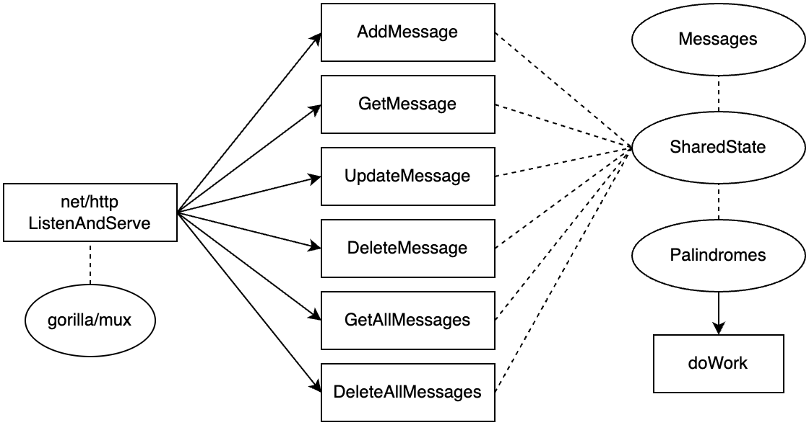
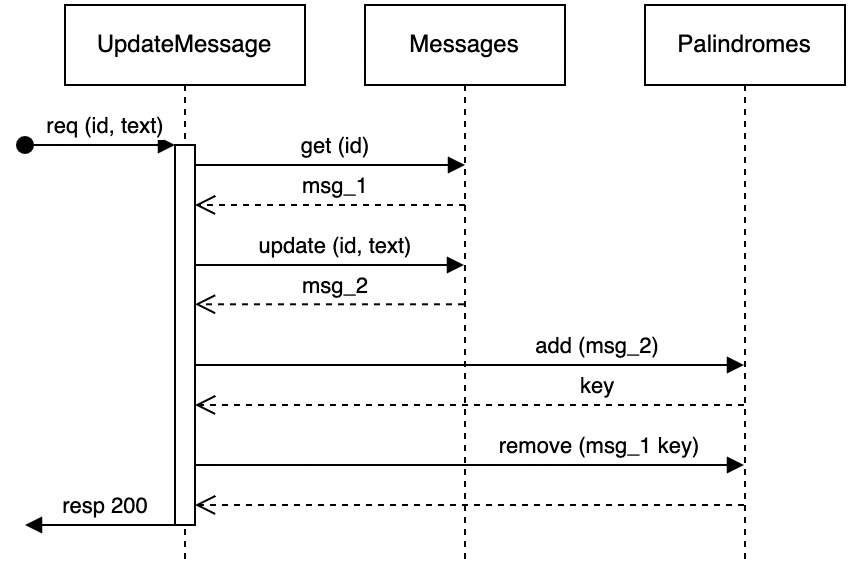
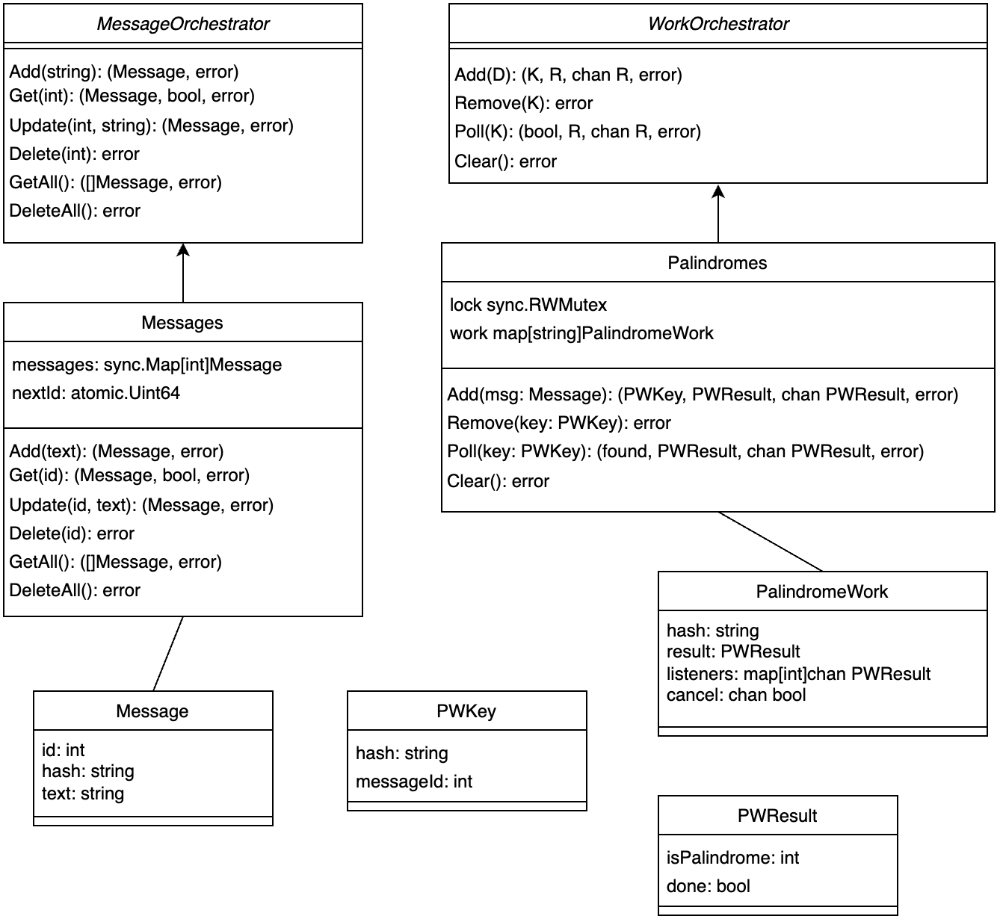

# Palindrome

This was intended to be a simple REST API. As implemented, data is not persisted; stopping the server will erase all user data. The design brief was:

> Create an application which manages messages and provides details about those messages, specifically whether or not a message is a palindrome. Your application should support the
> following operations:
>
> - Create, retrieve, update, and delete a message
> - List messages

But my implementation quickly got out of hand. If given this brief in a work setting, I would write much simpler code, and conversely, would spend much more time reviewing code of this complexity if it was actually intended for release. My goal was to have some fun and demonstrate my capabilities while still satisfying the requirements. Please keep this in mind while reviewing the repo.

## Endpoints

| Request               |  Handler          | Status             |
| --------------------- | ----------------- | :----------------: |
| POST /messages        | CreateMessage     | 201, 400, 500      |
| GET /messages         | GetAllMessages    | 200, 500           |
| DELETE /messages      | DeleteAllMessages | 204, 500           |
| GET /messages/{id}    | GetMessage        | 200, 400, 404, 500 |
| PUT /messages/{id}    | UpdateMessage     | 200, 400, 404, 500 |
| DELETE /messages/{id} | DeleteMessage     | 204, 400, 404, 500 |

All handlers are methods on a `SharedState` struct.

_Design Notes_

- The `DeleteAllMessages` endpoint was not required, but was convenient during testing
- `PUT` was chosen over `PATCH`, as the endpoint effectively replaces a message in it's entirety
- Favour using a plural noun ('messages' not 'message'), especially if there's a "get all" endpoint

### Request/Response Payloads

All request/response payloads are JSON. See [network_types.go](./network_types.go) for exact definitions.

Request payloads:

```js
// POST /messages
{
    "text": "some message text"
}

// PUT /messages/{id}
{
    "id": 123,
    "text": "some updated message text"
}
```

All other endpoints do not require a request payload. Response payloads:

```js
// POST /messages
{
    "id": 123
}

// GET /messages
{
    "messages": [{
        "id": 123,
        "text": "some message text",
        "is_palindrome": false // null / true / false
    }]
}

// GET /message/{id}
{
    "text": "the text"
    "is_palindrome": true // null / true / false
}
```

All other endpoints do not return a response payload.

_Design Note_: Messages retrieved via `GET /messages` have fields ['id', 'text', 'is_palindrome'] while a message retrieved via `GET /messages/{id}` has only ['text', 'is_palindrome']. At the time of writing, I wanted to remove redundant fields (this is also the reason why `PUT` doesn't respond with a payload). In retrospect this was probably not a good decision: downstream (future) code would be simpler to write if messages had a consistent type with no optional fields.

### Details

Message ids are positive integers starting at 1. Ids are guaranteed to be unique and are not re-used after message deletion. `GetAllMessages` returns messages sorted in ascending order by id.

Note that all 'is_palindrome' payload fields are parsed into a Golang struct field named 'isPalindrome', and vice-versa (in this project, JSON uses snake_case while Golang uses camelCase).

## Setup

The code was written and tested on MacOS using go1.23.6 darwin/arm64. It will not compile on Golang versions below 1.23.0, since [sync.Map.Clear()](https://pkg.go.dev/sync#Map.Clear) is used.

The server listens on port **8090** by default, but this is configurable (see PORT below). To run unit tests:
```shell
go test -v
```

There are more tests in the end-to-end-testing directory, written in Python. See [the README in there](./end-to-end-testing/README.md) for more information.

Run the server:
```shell
go run .
```

Run on port 3000 (default is 8090):
```shell
PORT=3000 go run .
```

Run with an artificial delay of 10 seconds (responses are normal speed, see [next section](#purposefully-overcomplicating-the-implementation)):
```shell
S_DELAY=10 go run .
```

Run the server in a docker container, on port 4000:
```shell
docker build -t liam/palindrome-demo .
docker run -p 4000:8090 liam/palindrome-demo
```

## Purposefully Overcomplicating the Implementation

_AKA: things get out of hand_

How can I challenge myself? If I'm going to make people wait 4 days for a simple REST API, the results better be impressive. What if palindrome calculation was non-trivial and took a really long time? Like determining whether "racecar" was a palindrome or not took ten seconds a lot of CPU. Imagine that palindrome calculation is a stand-in for any heavy workload, and now our server needs to be not only responsive but also capable of processing long-running tasks, almost like an RPC system.

Implementing this seemed fun and challenging to me, while also being vaguely applicable to the real world. I had thought about persisting data to disk (using a plain text file, sqlite, or even postgres), but wasn't excited about it, so let's continue with this new 'long-running-task-managment' design goal in mind.

The `S_DELAY` environment variable artificially slows down the method used to determine whether a string is a palindrome and save the result (`Palindromes.doWork(msg)`).

## Architecture


_Fig. 1_

Figure 1 depicts general data flow. All incoming requests hit [ListenAndServe](https://pkg.go.dev/net/http#ListenAndServe), which has been configured with [gorilla/mux](https://github.com/gorilla/mux) (so we can use url variables). Matched requests are routed to a handler (the middle column of rectangles in Figure 1), run in a per-request goroutine. All handlers have access to a `SharedState` struct, through which `Messages` and `Palindromes` are accessible.

`Messages` and `Palindromes` are two separate structs because they're responsible for different things. `Messages` methods are synchronous, whereas `Palindromes` can kick off work that could take awhile. Currently, each handler is responsible for ensuring consistency between `Messages` and `Palindromes`, a situation discussed in more detail later on (see Figure 2).

The `doWork` method (`Palindromes.doWork(msg)`) determines if some text is a palindrome and then saves the result. It may take time to calculate, so is always invoked in a new goroutine. If this code was actually running in production and doing real work, spawning a heavy goroutine without first checking how many are already running is *not ideal*.

### Files

- [main.go](./main.go): registers handlers to routes and starts the server (calls `ListenAndServe`)
- [handlers.go](./handlers.go): defines all the handlers
- [messages.go](./messages.go): defines `Messages`, which implements `MessageOrchestrator`
- [palindromes.go](./palindromes.go): defines `Palindromes`, which implements `WorkOrchestrator`
- [palindrome_calculation.go](./palindrome_calculation.go): defines functions for determining if text is a palindrome, including `doWork`.
- [helpers.go](./helpers.go): defines small, self-contained functions which could be useful in several places and don't belong anywhere else
- [shared_state.go](./shared_state.go): defines `SharedState` and provides the actual definition for some important interfaces (like `MessageOrchestrator` and `WorkOrchestrator`) and structs (like `Message`). It would be more typical to define the `Message` struct (for example) in the `messages.go` file, but I chose to define it in `shared_state.go` so we can get a quick overview of how the structs come together without having to look across multiple files.

Some files have an associated x_test.go file for unit testing.

## Handlers

Every handler follows three basic steps:

1. get request data
2. do something with `Messages` and `Palindromes`
3. return response data

The first and third steps are fairly standard, it's the second step that can get tricky. The second step could be encapsulated into another function or even another orchestrator (to make sure messages and palindrome calculations stay in sync). Let's look at the `UpdateMessage` handler ([code](./handlers.go#L103)).


_Fig. 2_

The above diagram details step 2 of `UpdateMessage`. Note that `msg_1` and `msg_2` are the same message at different points in time; they're different variables having the same message id; `msg_1` is the original while `msg_2` contains updated 'text' and 'hash' fields.

In between the `update (id, text)` call to `Messages` and the `add (msg_2)` call to `Palindromes`, it's possible for a message to exist without any corresponding palindrome work. This race condition is unaffected by `S_DELAY`. It's handled by simply returning `null` (aka `P_UNKNOWN`) for `is_palindrome`. It could be eliminated by replacing the `MessageOrchestrator.Add(string)` method with two others: one to create a message and another to save it. Step 2 of `UpdateMessage` would then look something like:

1. check if the message exists (`get (id)`)
2. create a new message, using the new `create (text)`
3. add palindrome work (`add (msg_2)`)
4. save the new message, using the new `save (msg_2)`
5. remove old palindrome work (`remove (msg_1 key)`)

When saving a message, `Messages` would have to verify that the message id is not already known. IMO, splitting 'add' into 'create' and 'save' is a better approach because it's more flexible and prevents the race condition, but it would also increase complexity.

## Shared State

All handlers are methods on the `SharedState` struct ([code](./shared_state.go#L10)). `SharedState` consists of `Messages`, which implements `MessageOrchestrator`, and `Palindromes`, which implements `WorkOrchestrator`. These two interfaces share nothing in common in terms of inheritance / composition / implementation, I just like the word 'orchestrator'. Let's look into the details of `Messages`, `Palindromes`, and associated structs.


_Fig. 3_

Both `Messages` and `Palindromes` are thread-safe. `Messages` relies on pre-defined data structures from Golang's sync package, but `Palindromes` uses an explicit mutex as it's operations are more complex. The generic types of `WorkOrchestrator` are: D for Data, K for Key, and R for Result. `Palindromes.work` uses `PWKey.hash` as keys.

A `PWKey`'s `messageId` and `hash` are identical to some `Message`'s `id` and `hash`; any `Message` can be converted into a `PWKey`. Each message corresponds to exactly one palindrome calculation, but a single palindrome calculation could correspond to multiple messages (if they have the same text, and therefore hash). This de-duplicates work.

Each message has a corresponding 'onChange' channel (stored in `PalindromeWork.listeners`) which will communicate all changes to the palindrome's work results; when a palindrome calculation finishes, each onChange channel for that palindrome will receive a `PWResult` with `done: true`. A read-only onChange channel is returned from both `Palindromes.Add(msg)` and `Palindromes.Poll(msg key)`. This allows currently asynchronous code (like the `UpdateMessage` handler) to easily become synchronous, if desired in the future, by blocking on an onChange channel read.

To determine if some message text is a palindrome, we must call `Palindromes.Add(msg)`. No new work is started if the message text is already known to be a palindrome or if a calculation is already running for some identical message text. Otherwise, `Palindromes.Add(msg)` will call `Palindromes.doWork(msg)` in a new goroutine. The `doWork` method is cancelled (exits early) if `Palindromes.Remove(key)` is called and no other messages are relying on the work.

The value of `PWResult.isPalindrome` is one of [ `P_UNKNOWN`, `P_TRUE`, `P_FALSE` ], aka [0, 1, 2], aka [ null, true, false ].

## Persistence

If `Messages` or `Palindromes` were to store data on disk, I see two possible approaches:

1. Pass a db pool/connection into the constructor. This approach is simple, and requires minimal changes to existing code. However the db connection could not be modified after instantiation, and I'm not sure how transactions across multiple methods could be implemented.
2. Modify methods to require a db pool/connection/tx parameter. This approach exposes complexity instead of encapsulating it. But it's more flexible, keeps the db connection in shared state, and could support transactions across methods. I would prefer this approach.

## Closing Thoughts

Strengths:

- Splitting fast and slow task processing into `Messages` and `Palindromes` illustrates a clean separation of concerns and is extensible.
- Two channels ('onChange' and 'cancel') can be used to safely and successfully interact with a long-running goroutine. Writes are asynchronous (they don't wait for a read) and buffered, de-coupling logic and improving overall speed.
- Despite over-complicating the implementation, development and delivery was on-schedule. Unknowns were identified early and scope was managed well. I followed a simple three-step plan: coding (and exploration), then testing, then documenting. Each step was time-boxed to stay on track.

Learnings:

- [Gorilla/mux](https://github.com/gorilla/mux) is an http multiplexer and works with Golang's net/http instead of replacing it entirely like [gin](https://github.com/gin-gonic/gin) or [fiber](https://github.com/gofiber/fiber).
- [Draw.io](https://app.diagrams.net/) is a free, open-source, less-polished version of [Lucid Chart](https://www.lucidchart.com/pages).
- My previous attempts at writing simple end-to-end tests for a REST API in Python left me disappointed, but not this time. The tests are understandable, useful, and easy to write.
- Leveraging channels such that there are conceptually clear producers/consumers (writers/readers) and preventing consumers from ever closing a channel decreases the chances of a panic-on-write and improves code quality.
