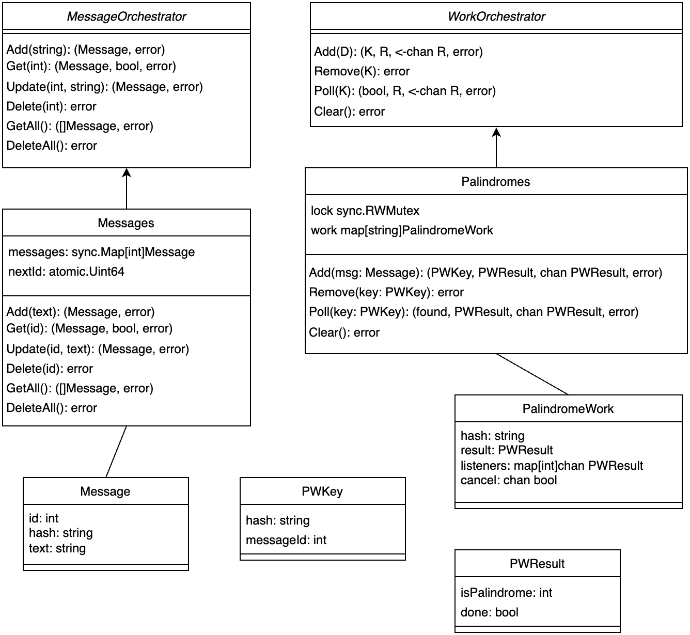

# Palindrome

This was intended to be a simple REST API. As implemented, data is not persisted: stopping the server will erase all user data. The design brief was:

> Create an application which manages messages and provides details about those messages, specifically whether or not a message is a palindrome. Your application should support the
> following operations:
>
> - Create, retrieve, update, and delete a message
> - List messages

But my implementation quickly got out of hand. If actually given this brief in a work setting, I would write much simpler code. Conversely, I would spend much more time reviewing code of this complexity if it was actually intended for release. My goal was to have some fun and demonstrate my capabilities, while still satisfying the task requirements. Please keep this in mind when reviewing the repo.

## Endpoints

| Request               | Response Status    | Handler           |
| --------------------- | ------------------ | ----------------- |
| POST /messages        | 201, 400, 500      | CreateMessage     |
| GET /messages         | 200, 500           | GetAllMessages    |
| DELETE /messages      | 204, 500           | DeleteAllMessages |
| GET /messages/{id}    | 200, 400, 404, 500 | GetMessage        |
| PUT /messages/{id}    | 200, 400, 404, 500 | UpdateMessage     |
| DELETE /messages/{id} | 204, 400, 404, 500 | DeleteMessage     |

All Handlers are methods on the SharedState struct, detailed later.

_Design Notes_

- The DELETE /messages endpoint was not required, but was convenient during testing
- PUT was chosen over PATCH, as the endpoint effectively replaces a message in it's entirety
- Favour using a plural noun (messages not message), especially if there's a "get all" endpoint

### Request/Response Payloads

All request/response payloads are JSON. See [network_types.go](./network_types.go) for exact definitions.

Request payloads:

```js
// POST /messages
{
    "text": "some message text"
}

// PUT /messages/{id}
{
    "id": 123,
    "text": "updated message text"
}
```

All other endpoints do not require a request payload. Response payloads:

```js
// POST /messages
{
    "id": 123
}

// GET /messages
{
    "messages": [{
        "id": 123,
        "text": "some message text",
        "is_palindrome": false // null / true / false
    }]
}

// GET /message/{id}
{
    "text": "the text"
    "is_palindrome": true // can be true / false / null
}
```

All other endpoints do not return a response payload.

_Design Note_
Messages retrieved via GET /messages have fields [id, text, is_palindrome] while a message retrieved via GET /messages/{id} has only [text, is_palindrome]. At the time of writing, I wanted to remove redundant fields (this is also the reason why PUT doesn't respond with payload). In retrospect this was probably not a good decision: downstream (future) code would be simpler to write if messages had a consistent type with no optional fields.

### Details

Message ids are positive integers starting at 1. They're guaranteed to be unique and are not re-used. Messages in the 'messages' payload response array field of a GET /messages request are sorted in ascending order by id.

Note that is_palindrome is parsed into a golang struct field named isPalindrome, and vice-versa.

## Setup

This code was written and tested on MacOS using go1.23.6 darwin/arm64. It will not compile on go versions below 1.23.0, since [sync.Map.Clear function](https://pkg.go.dev/sync#Map.Clear) is used.

The server listens on port 8090 by default, but this is configurable (see below). To run unit tests:

```shell
go test -v
```

There are more tests in the end-to-end-testing folder, but they use Python. See [the README in there](./end-to-end-testing/README.md) for more information.

Run the server:

```shell
go run .
```

Run on port 3000 (default is 8090):

```shell
PORT=3000 go run .
```

Run with an artificial delay of 10 seconds (responses are normal speed, see [next section](#purposefully-overcomplicating-the-implementation)):

```shell
S_DELAY=10 go run .
```

Or run the server in a docker container, on port 4000:

```shell
docker build -t liam/palindrome-demo .
docker run -p 4000:8090 liam/palindrome-demo
```

## Purposefully Overcomplicating the Implementation

_AKA: things get out of hand_

How can I challenge myself? If I'm going to make people wait 4 days for a simple REST API, the results better be impressive. What if palindrome calculation took a long time? Like determing whether "racecar" was a palindrome or not took ten seconds. Imagine that the palindrome calculation is a stand-in for any time-consuming workload, and now I have to build a server which is responsive but also capable of processing long-running tasks, almost like an RPC server.

Implementing this seemed fun and challenging to me, while also being vaguely applicable to the real world. I had thought about persisting data to disk (using a plain text file, sqlite, or even postgres), but this concept was more exciting. With these new design goals in mind, let's continue.

The `S_DELAY` environment variable is used to artificially slow down the `Palindromes.doWork(msg)` method, which determines whether a string is a palindrome and then stores the result.

## Architecture


_Fig. 1_

Figure 1 depicts general data flow. All incoming requests hit [ListenAndServe](https://pkg.go.dev/net/http#ListenAndServe), which has been configured to use [gorilla/mux](https://github.com/gorilla/mux) (so we can use url variables). Matched requests are routed to a handler (the middle column of rectangles in Figure 1), running in a per-request goroutine. All handlers have access to a SharedState struct, through which they can access a Messages and a Palindromes struct.

Messages and Palindromes are two separate structs because they're responsible for different things. Messages methods return immediately, whereas Palindromes kicks off work that could take awhile. Currently, each handler is responsible for ensuring consistency between Messages and Palindromes, a not-ideal situation discussed in more detail later on (see Figure 2 in [Handlers](#handlers)).

The `doWork` method determines if some text is a palindrome. It may take time to calculate, so is always invoked in a new goroutine. If this code was running in production, spawning a goroutine without checking how many are already running could be problematic.

### Files

- [main.go](./main.go): registered handlers to routes and starts the server (calls `ListenAndServe`)
- [handlers.go](./handlers.go): defines all the handlers
- [messages.go](./messages.go): defines `Messages`, which implements `MessageOrchestrator`
- [palindromes.go](./palindromes.go): defines `Palindromes`, which implements `WorkOrchestrator`
- [palindrome_calculation.go](./palindrome_calculation.go): defines functions for determining if text is a palindrome.
- [helpers.go](./helpers.go): small, self-contained functions which could be useful in several places and don't belong anywhere else
- [shared_state.go](./shared_state.go): defines `SharedState` and provides the actual definition for some important interfaces (like `MessageOrchestrator` and `WorkOrchestrator`) and structs (like `Message`). I think it would be more typical to define the `Message` struct (for instance) in the `messages.go` file, but I chose to define it in `shared_state.go` so we can get a quick overview of how important structs come together, instead of having to look in different files. See [Figure 3](#shared-state) for more details.

Some files have an associated x_test.go file for unit testing.

## Handlers

Every handler follows three basic steps:

1. get request data
2. do something with Messages and Palindromes
3. return response data

The first and third steps are fairly standard, it's the second step that can get tricky. The second step could be encapsulated into other functions or even another orchestrator (to make sure Messages and Palindromes stay in sync). Let's look at the `UpdateMessage` handler.


_Fig. 2_

The above diagram details step 2 of UpdateMessage: how it interacts with Messages and Palindromes. `msg_1` and `msg_2` are the same message at two different points in time; different variables having the same message id. `msg_1` is the original, `msg_2` has updated text and hash.

Inbetween the `update (id, text)` call to `Messages` and the `add (msg_2)` call to `Palindromes`, it is possible for a message to exist without any corresponding palindrome work. This race condition is not affected by `S_DELAY`. This situation is handled by simply returning `null` for `is_palindrome`, aka `P_UNKNOWN`. It could be eliminated by replacing the `MessageOrchestrator` 'add' method in with two others: one to create a message and another to save it. The flow would then be:

1. check if the message exists (`get (id)`)
2. create a new message, using the new `create (id, text)`
3. add palindrome work (`add (msg_2)`)
4. insert the new message, using the new `insert (msg_2)`
5. remove old palindrome work (`remove (msg_1 key)`)

On insert, `Messages` would have to verify that the id of the message to be inserted does not already exist. I think this is an overall better approach because it's more flexible and prevents the race condition, but it does put more work on whatever code is calling `Messages`.

## Shared State

`SharedState` consists of `Messages` which implements `MessageOrchestrator` and `Palindromes` which implements `WorkOrchestrator`. The two interfaces share nothing in common (in terms of inheritance / composition / implementation), I just like the word 'orchestrator'. Let's look at the specifications for `Messages` and `Palindromes`.


_Fig. 3_

Both `Messages` and `Palindromes` are thread-safe. `Messages` can get by with using pre-defined data structures provided by the sync package, but `Palindromes` uses an explicit mutex as it's operations are more complex.

A `PWKey`'s `messageId` and `hash` are identical to some `Message`'s `id` and `hash`. Each `Message` has a corresponding onChange channel (stored in a `PalindromeWork`'s `listeners`) which will receive all updates on the message's palindrome work.

To determine if some message text is a palindrome, we must call `Palindromes.Add(msg)`. If the message text is already known to be a palindrome or if a calculation is already running for some identical message text (based on the presence of a matching `PalindromeWork`), no new work is started. Otherwise, `Palindromes.Add(msg)` will call `Palindromes.doWork(msg)` in a new goroutine. `doWork` may be cancelled if `Palindromes.Remove(key)` is called.

## Persistence

If `Messages` and `Palindromes` were to store data to disk, I see two possible approaches:

1. Pass a db pool/connection into the constructor. This approach is simple, and requires little modification to existing code. However the db connection could not be modified after instantiation, and I'm not sure how transactions across multiple methods could be implemented.
2. Modify the interface so all methods require a db pool/connection/tx. This approach requires modifying a lot of existing code and puts more work on the calling code (has to manage the db connection). It is more flexible, keeps the db connection in shared state, and could support transactions across methods. I would prefer this approach.

## Reasoning

TODO: above has been edited, below has not

Make this a separate document?

Read the entire brief several times. First question: what language? Decided on golang as I'm good at it and know the company uses it. It's also easy to get up and running.

Next, endpoints. WHat endpoints do we need and what will they do? Need to follow REST best practices. Came up with the list as they are above, but without the DeleteAll endpoint.

Next, what's my timeline? I wanted to get this done quickly, it's a pretty simple service. But it was a Thursday, and already mostly gone. Let's aim for Monday. That gave me two extra days (Saturday and Sunday) with which to hang myself (increase complexity beyong what's needed).

With the timeline sorted out, let's hammer out the scope. How to serve? Use a framework / package, write my own, or built-in net/http? I decided on net/http, but would later add gorilla/mux for url variable support.

Next, do I want messages to be persisted to disk somehow? I decided know. It's doable, but I wanted to spend my time in other areas. The brief was unclear. If this was a real assignment, I would definitely reach out for clarification.

Next, the overall architecture of the service. How to break it into manageable pieces with nice abstractions and encapsulations? My original idea was to have a Messages struct, which would handle everything related to messages.

Next, how to schedule my time? I like writing code first (for better or worse). I wanted to have the code finalized by noon Friday, so I could spend a lot of time on documentation.

What are the unknowns for the code? What questions do I have? Do I need to reach out to answer them? I decided to:

1. Get a minimal API service running with all the packages I'd need.
2. Establish how to share state
3. Add non-function endpoints. It was during this step I realized the necessity for gorilla/mux.
4. Write the Messages struct
5. Make the endpoints functional
6. Add unit tests
7. Add end-to-end tests
8. Documentation

Establishing how to share state took some thinking. Ended up going with this [approach](https://drstearns.github.io/tutorials/gohandlerctx/#secreceivers).

Right off the bat I knew I wanted end-to-end tests, but didn't know exactly how. I'd also never done unit testing in production go code but knew it was possible. After reading some documentation on go test, quickly integrated a bunch of those. (started [here](https://go.dev/doc/tutorial/add-a-test))

Wrote a checklist, marked things off and added things as need-be. One of the things I wasn't sure about was how to organize the project? Other go projects I've worked on have had all the files in a single directory, and I wasn't sure it was kosher (certainly not for scoping / visibility / field privacy: I know fields are accessible to all code in the same package). After reading [this](https://go.dev/doc/modules/layout) I kept the flat layout.

Both the unit tests and the end-to-end tests ended up catching bugs, so I'm glad I wrote them.

Earlier, branching strategy? Git commit message format? It was a given from the start that I would use Github; it's what I'm familiar with but also was requested in the brief. Could just commit everything to main. Decided to use some sort of 'feature branch' strategy, which was more like a what-part-of-the-project-i'm-on strategy. So there ended up being five branches (as of right now): main, comments, scratch, separate-palindromes, and tests.

- scratch was for figuring out all the packages, getting things running, getting an initial version out (all the way up to step 5)
- tests came along afterwards, and was for step 6 and 7
- then separate-palindromes came in, when I realized I didn't like the architecture of the program (more later)
- then finally comments, for all documentation

The separate-palindromes branch became necessary when I realized I wanted to do a big re-write on Friday. We know the plan, but how did it actually work out in practice?

The service was working by Thursday night. And the code supported an artifical delay for calculating palindromes. But as usual, in my time spent not coding, I was thinking about the code.

I realized that the Messages struct was doing too much, and I should have a Palindromes struct for long-running work. This separation of concerns would support extensibility and clarity. This came to me Thursday night, and I wanted to do a big re-write on Friday. Ended up missing the deadline of code-freeze Friday noon, ended up being Saturday noon.

Handling parallel code was lovely, and used several primitives from the [sync](https://pkg.go.dev/sync) package. I had to re-introduce myself to channels, and how they are meant to be one-way communication. That was part of my problem with doing everything in Messages approach: it exposed a 'cancel' channel which was meant to be written to outside of the Messages struct, but could be closed inside of it.

Now onto documentation. A couple of things were obvious to me: I knew other languages have some commenting standards or tools which can automatically understand comments, and I wanted that. I quickly re-discovered the [godoc specification](https://tip.golang.org/doc/comment) and ran with that.

I took a brief detour at looking into OpenAPI docs (I've used Swaggerhub before), but decided it wasn't worth it.

Comments are good, also need a README. Left that until last so I could write with confidence.

Then diagrams. I was dreading this. I'd used Lucid Chart and Mermaid before, but was not impressed with either (found both cumbersome). Then I realized I should figure out what diagrams I wanted? Looked around at what was possible, some I'd heard of and some I hadn't (C4, sequence, service architecture diagram, UML, flowchart with swimlanes). Decided I needed a sequence diagram for the UpdateMessage handler, as I had looked at that code several times to make sure it was correct, and a diagram would help me understand. Knew I wanted an overall architecture diagram but wasn't sure how (still not quite sure).

Now I went looking for software to help me, found draw io, which reminded me alittle bit of Lucid Chart but was open source so felt better. And they have a desktop app! Figured out how to export higher-quality pngs. Figured out how to embed a png in markdown. And we're off to the races.

Came up with a basic architecture diagram, not following any sort of specific template but I like it.

Decided a UML diagram would be helpful for the Messages and Palindromes structs, and their associates. Three different diagrams, all helpful I think.

Now I'm finishing the README. Will go through several edits, clean up my verbiage, re-organize (while practicing a presentation). Will definitely keep tweaking it. And will go back and read the brief again to figure out what I missed.

But back to my overall approach. Questions: how can I accomplish this task simply? What questions do I have? How long will that take? How can I accomplish this task better?

## EDITS

(Text I've cut while editing, kept here in case I want to reinsert it)

Like every REST API, there needs to be some handlers. The built-in net/http doesn't support url variables, so let's use gorilla/mux. Now we can easily handle calls like GET /messages/17.

I decided not to make the data persistent. This eases set up (so other people can run the code more easily). It also eases testing (just re-start the server, and we get a blank slate).

Aside: the brief says "Provide some REST API documentation (either in Readme or in-line code)", so I should make sure this is very visible.

There are several consequences to this decision:

1. The API still needs to be responsive. It can't wait for work to finish. So we need explicit goroutines
2. Goroutines means more thought needs to go into synchronization, and concurrent / parallel safe code
3. We can't know the result of some work until later, so null values are required, or explicit in_progress status fields
4. Some things can be done quickly and immediately. Separating the immediate and the eventual is crucial

I wanted the long-running tasks to be somewhat efficient. So if two messages come in with the same text, only one calculation is required. If a message is created then immediately deleted, cancel the work being done in the background.

- gorilla mux, net/http -> every request gets a new goroutine
- handlers are all methods on a shared state object
- the shared state object has a message orchestrator, and palindrome work orchestrator
- handlers all follow a pattern of: get payload data / url variables, call orchestrators, then return
- generally update messages before updating palindrome work, but the code will still handle cases where a message exists but it's work does not
- all request and response payloads have their own type
- handlers do a lot of work. That work could be encapsulated into other functions or even another orchestrator (to make sure Messages and Palindromes stay in sync). This approach was not taken due to time constraints.

I don't know exactly when / how many goroutines / threads are spawned / used by net/http (especially how responses are returned).


